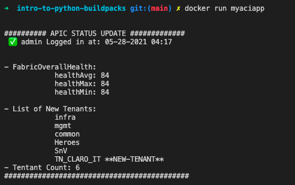

# startnow-Intro-to-Python-buildpacks

This repo walks through the basics of using a python build pack to build your docker containers.

This app leverages [buildpack.io](https://registry.buildpacks.io/searches/python) and the Cisco DevNet [ACI Always On Sandbox](https://devnetsandbox.cisco.com/RM/Topology) to gather the FabricOverallHealth and also verify Tenants in ACI.

To sign up for DevNet: [Start Now](http://cs.co/startnowduan)

>Special thanks to [DaShaun](https://twitter.com/dashaun) from Redis Labs for introducing me to this awesome tool!

___

## Why use buildpacks

Building and maintaining a `Dockerfile` can be a pain. Most network engineers just want to get their app up and running without worrying about the things they don't need to.

This is where buildpacks come in because they remove the pain of building a container like:

- Finding the right images
- Security risks do to patching
- Time it takes to build a `Dockerfile`

They give you the ability to containerize your entire app in as little as 1 command. The buildpack will handle the version of python that will be used along with installing all of the dependencies from the requirements.txt file.

NOW THATS SWEET!
___

## How To Get Started

1. Build your app:

    ```bash
    ➜  startnow-Intro-to-Python-buildpacks git:(main) ✗ tree -L 2
    .
    ├── LICENSE
    ├── Procfile
    ├── README.md
    ├── __init__.py
    ├── app
    │   ├── __init__.py
    │   ├── aci_conn.py
    │   └── aci_webex.py
    ├── cards
    │   └── card.json
    ├── images
    │   ├── devi.jpeg
    │   ├── image.png
    │   └── results.png
    ├── main.py
    ├── requirements.txt
    ├── tenant_log.txt
    ```

    >NOTE: In this repo we have all the files needed to containerize our python app.

2. [Install docker](https://hub.docker.com/search?type=edition&offering=community): This is needed to run your app once its containerized.

3. Once docker is installed we have to then install the `pack CLI` tool to build our containers from buildpack

    >NOTE: Pack is maintained by the Cloud Native Buildpacks project to support the use of buildpack

    https://buildpacks.io/docs/tools/pack/

4. After installation verify the installed `pack CLI` version

    ```bash
    pack --version
    ```

5. Create the default builder that will be used for packeto. A builder includes the buildpacks and everything we need like our environment for building our python app.

    ```bash
    pack config default-builder paketobuildpacks/builder:full
    ```

    >You can use `pack builder suggest` to view a list of suggested builders

6. Before we containerize our app we need to create a file in our root directory called `Procfile`. Here is where we add our "process type" i.e. `web, worker, urgentworker, clock` and so on and then we enter our command argument that should be executed on startup.

    ```bash
    web: python main.py
    ```

    For more information on the [Procfile](https://devcenter.heroku.com/articles/procfile)

7. Now lets build the app using the latest python build pack

    ```bash
    pack build myaciapp --buildpack paketo-community/python@0.4.1
    ```

    To find build packs: [https://registry.buildpacks.io/searches/python](https://registry.buildpacks.io/searches/python)

8. We can now verify that our app image has been built by executing:

    ```bash
    docker images myaciapp
    ```

    

9. It's time to run our app:

    ```bash
    docker run myaciapp
    ```

    

10. Our app gives us the ability to pass in command line arguments when we run our docker container. This gives up the ability to changes our ACI login params as well as provide our `webex_token` and the name of our `webex_room` to update a webex room.

    ```bash
    ➜  startnow-Intro-to-Python-buildpacks git:(main) ✗ docker run \
    > -e webex_token="OWNlMjFhNGMtOG2cae0e10f" \
    > -e webex_room="DuAn AciDemo Room" \
    > myaciapp
    ```

    

    ```bash
    (venv) ➜  startnow-Intro-to-Python-buildpacks git:(main) ✗ python main.py --help  
    usage: main.py [-h] [--url URL] [--username USERNAME] [--password PASSWORD]
                [--webex_token WEBEX_TOKEN] [--webex_room WEBEX_ROOM]

    Arguments: url, username, password, webex_token, webex_room

    optional arguments:
    -h, --help            show this help message and exit
    --url URL             Optional argument to pass url or ip of APIC Default:
                            'https://sandboxapicdc.cisco.com'
    --username USERNAME   Optional argument to pass username for APIC user
                            Default: 'admin'
    --password PASSWORD   Optional argument to pass password for FMC user
                            Default: 'ciscopsdt'
    --webex_token WEBEX_TOKEN
                            Optional argument to pass webex api token
    --webex_room WEBEX_ROOM
                            Optional argument to pass webex room name ***NOTE***
                            arg must be passed with token
    ```

    >To learn more about using Adaptive Cards in webex: [https://developer.webex.com/docs/api/guides/cards](https://developer.webex.com/docs/api/guides/cards)
___

## Notes

Buildpacks were introduced by Heroku, in 2011, and adopted by Cloud Foundry, Gitlab, Knative and others.

Cloud Native Buildpacks began with Heroku and Pivotal in early 2018.

Cloud Native Buildpacks joined the CNCF in October 2018.

By using the Python Buildpack you don't have to worry about building the dockerfile configuration

The build pack will automatically grab the `Procfile`, `buildpack.yml`, `requirements.txt`

___

### About me

Introverted Network Automation Engineer that is changing lives as a Developer Advocate for Cisco DevNet. Pythons scripts are delicious. Especially at 2am on a Saturday night.

Contact Me:

- [LinkedIn](https://www.linkedin.com/in/duanlightfoot/)

- [Twitter](https://twitter.com/labeveryday)
